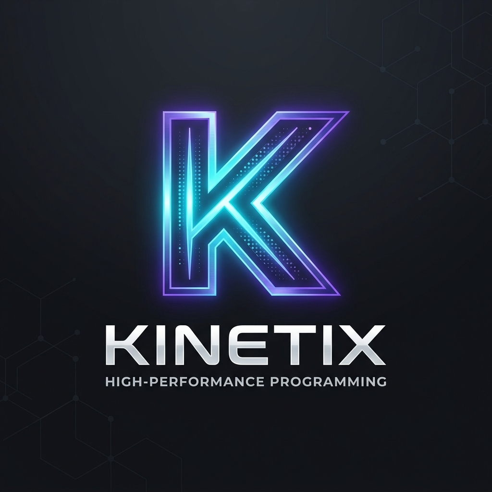
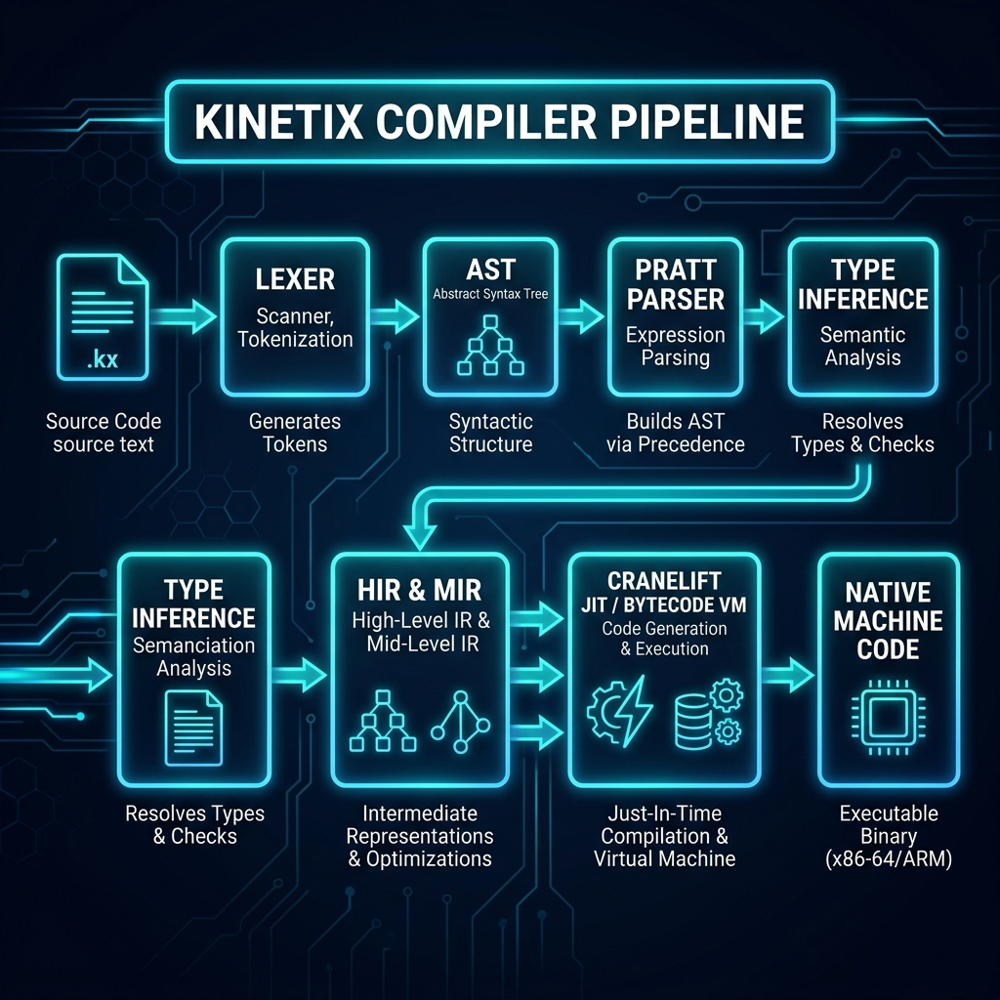
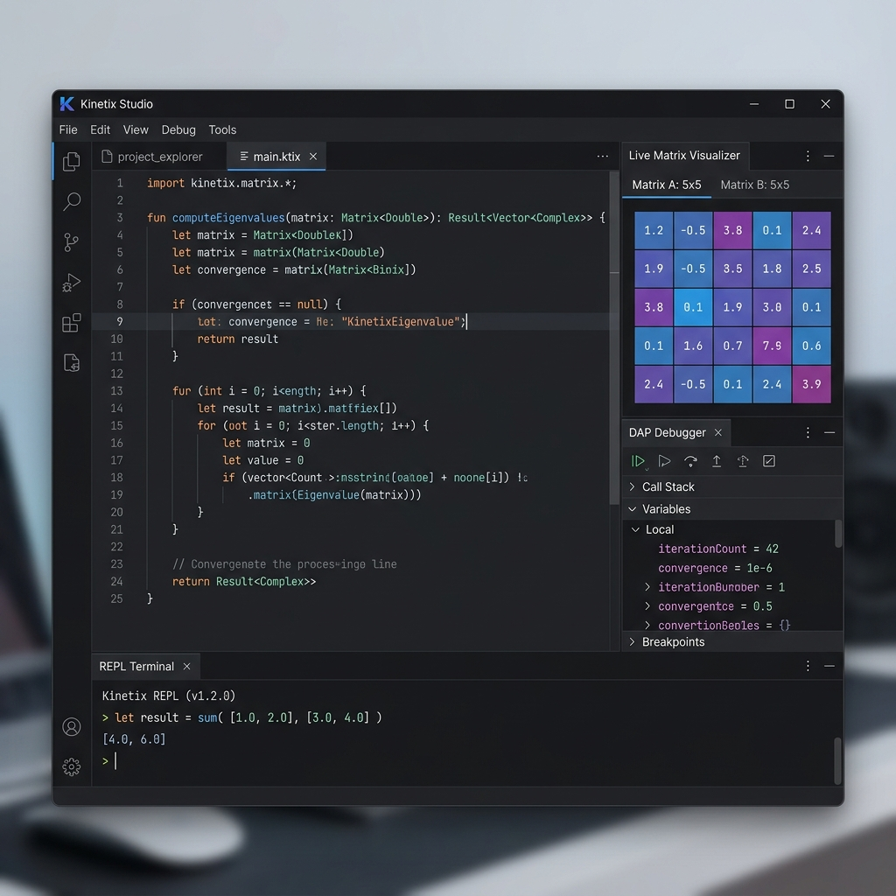

<p align="center">
  
</p>

<h1 align="center">Kinetix — High Performance Engine</h1>

<p align="center">
  <b>A statically-typed, JIT-compiled, matrix-first programming language inspired by C++, Rust, and MATLAB.</b>
</p>

<p align="center">
  <a href="#key-features">Key Features</a> •
  <a href="#architecture">Architecture</a> •
  <a href="#quick-start">Quick Start</a> •
  <a href="#industrial--robotics-use-cases">Industrial Use Cases</a> •
  <a href="#tooling--cli">Tooling</a> •
  <a href="#workspace-structure">Workspace</a>
</p>

---

## What is Kinetix?

**Kinetix** is an independent programming language built from scratch with **no external language runtime dependencies**. It solves the **dual-codebase problem** in engineering, robotics, quantitative finance, and signal processing by combining the clean matrix syntax of MATLAB with the deterministic speed and safety of Rust and C++.

| Language | What Kinetix Borrows |
| :--- | :--- |
| **MATLAB** | Native 2D matrix literals (`[[1.0, 2.0]; [3.0, 4.0]]`), transpose, linear algebra operators, range expressions |
| **Rust** | Hindley-Milner type inference, pattern matching, closures, module system, memory safety |
| **C++** | Structs, impl blocks, operator overloading, native compilation speed, C-FFI interoperability |

---

## Architecture Overview

Kinetix features a modular compiler pipeline that transforms source code into native machine instructions via Cranelift JIT or executes it directly on its register-based virtual machine.

<p align="center">
  
</p>

```
Source (.kx) ──► Lexer ──► Pratt Parser ──► Type Checker ──► HIR ──► MIR ──► Cranelift JIT / Bytecode VM
```

---

## Key Features

- ⚡ **Cranelift JIT & Native Execution**: Compiles directly to x86_64 and ARM64 machine code for 1000Hz real-time performance.
- 🔢 **First-Class Matrix Types**: Built-in `matrix<T>` support with linear algebra operations (`matmul`, `transpose`, `trace`, `linspace`, `zeros`, `eye`).
- 🛡️ **Memory Safety without Heavy GC**: Uses reference counting (`Arc`) with cycle detection — zero Global Interpreter Lock (GIL) and no Stop-The-World pause spikes.
- 🛠️ **Integrated Toolchain**: Bundled compiler (`kxc`), runner/REPL (`kxr`), formatter (`kxfmt`), package manager (`kxpkg`), LSP server (`kinetix_lsp`), and DAP debugger (`kinetix_debugger`).

---

## Native IDE & Matrix Visualizer

Kinetix provides an embedded desktop IDE environment featuring code editing with syntax highlighting, DAP debugging, REPL terminal, and a **Live 2D Matrix Inspector**.

<p align="center">
  
</p>

---

## Quick Start

### 1. Code Sample (`main.kx`)

```rust
// Kinetix Linear Algebra & Matrix Demo
import std::io
import std::matrix

fn main() {
    io::println("=== Kinetix Matrix Demo ===")

    // Native matrix literal
    let A = [[1.0, 2.0]; [3.0, 4.0]]
    let B = [[5.0, 6.0]; [7.0, 8.0]]

    // Matrix multiplication & transpose
    let C = matmul(A, B)
    let At = transpose(A)
    let tr = trace(A)

    io::println("Matrix C = A * B:")
    io::println(C)

    io::println("Trace of A:")
    io::println(tr)

    // Vector linspace
    let v = linspace(0.0, 1.0, 5)
    io::println(v)
}
```

### 2. Tooling Usage

```bash
# Compile to bytecode / native binary
kxc main.kx -o main

# Run interactively using the REPL or runner
kxr main.kx

# Format source code
kxfmt --write main.kx

# Package Manager: Create & run a project
kxpkg new my_robot_node
cd my_robot_node
kxpkg run
```

---

## Industrial & Robotics (ROS / ROS 2) Use Cases

Kinetix specifically targets real-time engineering applications where Python is too slow and C++ is too complex:

1. **ROS / ROS 2 Robotics Control Nodes**: Write kinematics, Kalman filters, and sensor fusion algorithms in clean matrix syntax without Python's GIL latency or C++ Eigen template complexity.
2. **Quantitative Finance**: Microsecond-latency matrix portfolio optimization and high-frequency risk models.
3. **Aerospace & Autonomous Vehicles**: On-board trajectory optimization and embedded autopilot control loops.
4. **Edge Computing**: Lightweight binaries (`kxc`) running on NVIDIA Jetson or Raspberry Pi devices without requiring heavy language runtime environments.

---

## Workspace Structure (15 Crates + 4 CLI Tools)

```text
Kinetix_Language_Foundation/
├── Cargo.toml                  # Root workspace manifest
├── README.md                   # Project landing page
├── LANGUAGE_SPEC.md            # Formal grammar & language spec
├── ROADMAP.md                  # Implementation roadmap
├── assets/                     # Visual diagrams, logo & screenshots
├── crates/
│   ├── kinetix_lexer/          # Tokenizer & error-resilient spans
│   ├── kinetix_ast/            # AST expression, statement & type nodes
│   ├── kinetix_parser/         # Hand-written Pratt parser & error recovery
│   ├── kinetix_types/          # Hindley-Milner type inference & checker
│   ├── kinetix_hir/            # High-Level IR & AST lowering
│   ├── kinetix_mir/            # Mid-Level IR CFG & optimization passes
│   ├── kinetix_bytecode/       # 4-byte register-based instruction set
│   ├── kinetix_vm/             # Register VM, CallFrame & runtime values
│   ├── kinetix_gc/             # Reference-counting GC & cycle detector
│   ├── kinetix_codegen/        # HIR-to-bytecode compiler
│   ├── kinetix_jit/            # Cranelift JIT compiler backend
│   ├── kinetix_stdlib/         # Standard library (io, math, matrix, vec, map)
│   ├── kinetix_debugger/      # DAP session & breakpoint manager
│   ├── kinetix_lsp/           # Language Server Protocol server
│   ├── kinetix_syntax/        # Token classifier & HTML syntax highlighter
│   └── kinetix_ide/           # Embedded IDE engine & REPL session
├── tools/
│   ├── kxc/                    # Compiler CLI binary
│   ├── kxr/                    # JIT Runner & REPL CLI binary
│   ├── kxfmt/                  # Code formatter CLI binary
│   └── kxpkg/                  # Package manager CLI binary
└── examples/
    ├── matrix_demo.kx          # Matrix & linear algebra sample
    └── fibonacci.kx            # Benchmark sample
```

---

## License

Kinetix is licensed under the [MIT License](LICENSE).
